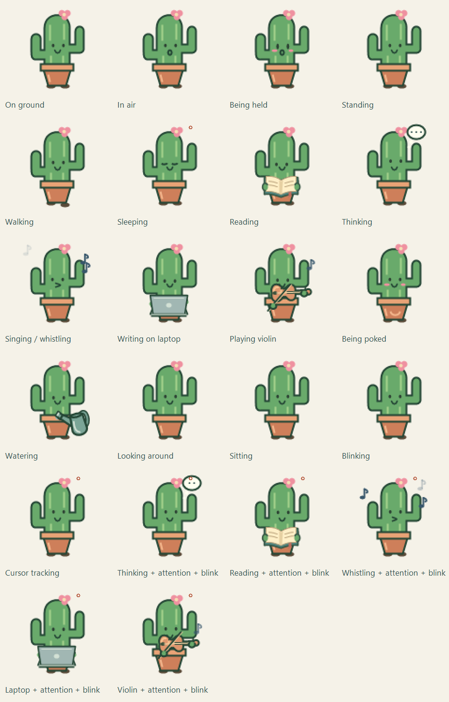

# Cacti visual reference

Generated automatically by `dotnet build src/WinPet.sln`, or `tools\generate-previews.cmd`. Open [the gallery](index.html) for animated cards and still/animation controls. These files belong in source control; regenerate and review them with artwork changes. Do not edit them manually.

PNGs: native 76 × 92, transparent. GIFs: 2× artwork on cream, 20 fps, eight-second loops. The ring represents cursor direction. Previews show artwork in place, not a desktop physics simulation. Activity transition clips use a shortened hold; production durations are unchanged.

## Physical states

- **On ground** — Supported, standing quietly. [PNG](on-ground.png) · [GIF](on-ground.gif)
- **In air** — Airborne expression; blinking continues. Midair pokes keep this expression. [PNG](in-air.png) · [GIF](in-air.gif)
- **Being held** — Picked up: wide eyes and blush, with independent blinking. [PNG](held.png) · [GIF](held.gif)

## Activities

- **Standing** — Idle gaze and natural blinking. [PNG](standing.png) · [GIF](standing.gif)
- **Walking** — Foot stride and blinking run independently. [PNG](walking.png) · [GIF](walking.gif)
- **Sleeping** — Eyes stay closed, even with a nearby cursor. [PNG](sleeping.png) · [GIF](sleeping.gif)
- **Reading** — Open the book, read and turn pages, then put it away. Review clip uses a shortened hold. [PNG](reading.png) · [GIF](reading.gif)
- **Thinking** — Thought bubble with centered dots; blink continues. Review clip uses a shortened hold. [PNG](thinking.png) · [GIF](thinking.gif)
- **Singing / whistling** — Puckered lips and silent notes. Review clip uses a shortened hold. [PNG](singing.png) · [GIF](singing.gif)
- **Writing on laptop** — Alternating typing taps and a short thinking pause. Settled writing lasts 20–28 seconds; this review shortens the hold. [PNG](laptop.png) · [GIF](laptop.gif)
- **Playing violin** — Warm wooden violin and back-and-forth bowing (silent). Settled playing lasts 18–25 seconds; this review shortens the hold. [PNG](violin.png) · [GIF](violin.gif)
- **Being poked** — Grounded click reaction: blush and smile. [PNG](poked.png) · [GIF](poked.gif)
- **Watering** — You water Cacti with a little watering can that tips into the pot, then moves away. [PNG](watering.png) · [GIF](watering.gif)
- **Looking around** — Autonomous side-to-side gaze. [PNG](looking.png) · [GIF](looking.gif)
- **Sitting** — Resting awake; eyelids still blink. [PNG](sitting.png) · [GIF](sitting.gif)

## Shared extras

- **Blinking** — Continuous close, brief hold, reopen; independent of activity time. [PNG](blinking.png) · [GIF](blinking.gif)
- **Cursor tracking** — Marker moves left, up, right, down, then away; eyes ease back to their default. [PNG](cursor-tracking.png) · [GIF](cursor-tracking.gif)

## Combinations

- **Thinking + attention + blink** — Bubble, cursor gaze and eyelids coexist. [PNG](thinking-attention.png) · [GIF](thinking-attention.gif)
- **Reading + attention + blink** — Glances toward cursor with a slight bookward bias. [PNG](reading-attention.png) · [GIF](reading-attention.gif)
- **Whistling + attention + blink** — Mouth and notes continue while eyes track and blink. [PNG](singing-attention.png) · [GIF](singing-attention.gif)
- **Laptop + attention + blink** — Typing continues while eyes follow the cursor and blink. [PNG](laptop-attention.png) · [GIF](laptop-attention.gif)
- **Violin + attention + blink** — Bowing continues while eyes follow the cursor and blink. [PNG](violin-attention.png) · [GIF](violin-attention.gif)
